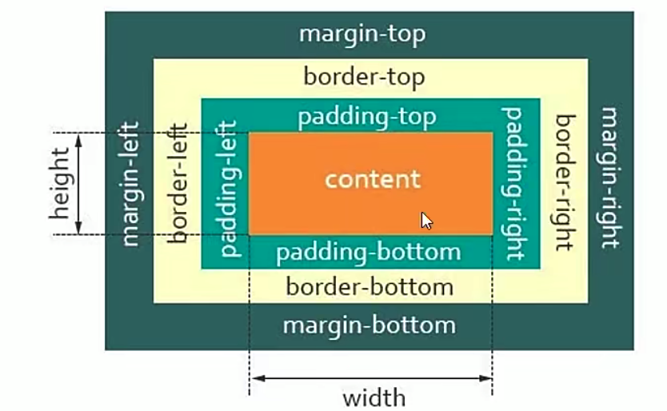
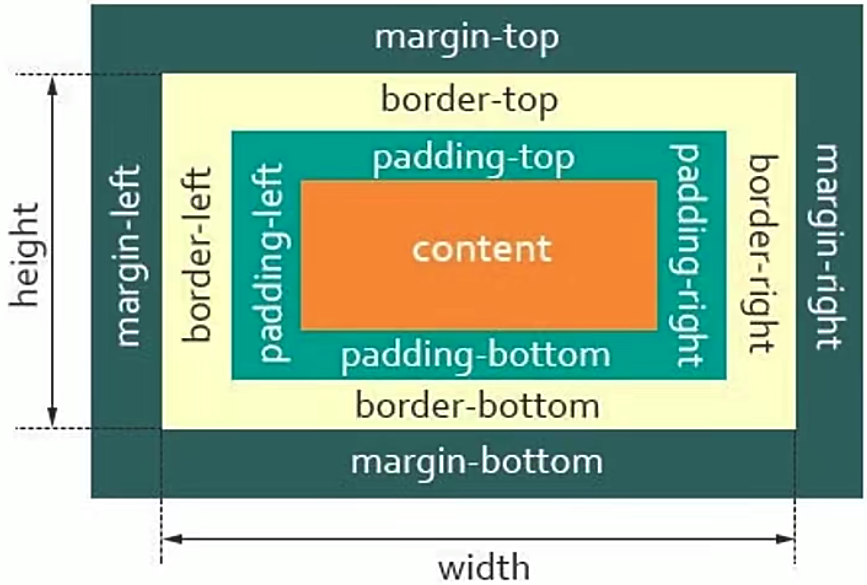

# CSS那些事

## 盒子模型

一个正常的CSS盒子 = 显示内容(content) + 内边距(padding) + 边框(border) + 外边距(maigin)

- 块级盒子（Block box）

    1. 盒子会在内联的方向拓展并占据父容器在该方向上的所有可用空间，在绝大数情况下意味着`盒子会和父容器一样宽`。
    2. 每一个盒子都会换行
    3. `width`和`height`属性会发生作用
    4. 内边距，外边距和边框都会将其他元素从当前盒子周围推开
    5. 一般div，h1，p标签默认情况下都是块级盒子

- 内联盒子（Inline box）

    1. 盒子不会产生换行
    2. `width`和`height`属性不会发生作用
    3. 垂直方向的内边距，外边距以及边框会被应用但是不会把其他处于inline状态的盒子推开
    4. 水平方向的内边距，外边距以及边框会被应用且会把其他处于inline状态的盒子推开
    5. 一般a，span，em，strong等标签默认都是内联盒子

一般我们通过对标签的display属性的设置，display: block比如或者display: inline，来控制盒子的`外部显示类型`。

> css的box模型有一个外部显示类型，来决定盒子是块级还是内联。
> 同样盒模型还有内部显示类型，它决定了盒子内部元素是如何布局的。默认情况下是按照 正常文档流 布局，也意味着它们和其他块元素以及内联元素一样(如上所述)
> 我们可以通过使用类似 display: flex 来更改元素内部显示类型。 如果设置 display: flex，在一个元素上，外部显示类型是 block，但是内部显示类型修改为 flex。该盒子的所有直接子元素都会成为flex元素，会根据 弹性盒子（Flexbox ）规则进行布局。

对一个特定元素而言，内联和块之间提供了一个中间状态那就是`display: inline-block`，实现我们需要块级元素和内联元素的部分效果：

- 设置`width`和`height`属性会生效
- padding, margin, 以及border 会推开其他元素
- 不会产生换行
- 显式添加width 和height 属性，它只会变得比其内容更大

## box-sizing

>盒模型宽度 = content + padding（左右） + border（左右） + margin（左右）。

- box-sizing: content-box(标准盒模型，默认值)

  标准模式下，如果我们给盒子设置的 width 和 height，实际设置的是盒模型中`content`的。（width = content）

  在盒模型给定的width 和 height中；内边距，边框和外边距的大小决定了整个盒模型的高和宽。

  同理，盒模型宽度 = width + padding（左右） + border（左右） + margin（左右）。

  

- box-sizing: border-box（怪异盒模型，IE盒模型 ）

  怪异模式下，如果我们给盒子设置的 width 和 height，实际设置的是 conent + padding + border的。（width = content + padding（左右） + border（左右））

  在盒模型给定的width 和 height中；只有外边距的大小决定了整个盒模型的高和宽。

  同理，盒模型宽度 = width + margin（左右）。

  
