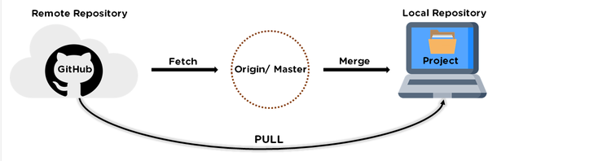

# git常用指令记录

> 基于自己使用习惯记录
> 没事多看看
> 一下所有内容都是通过指令进行处理

## 基础内容

- git status

  查看工作区的内容
- git add xx/.

  提交 `特定文件/所有文件` 进入`暂存区`

- git commit -m 'xxx'

  提交`暂存区的内容`进入分支，xxx为提交描述

## 内容删除/回退

- rm xx

  删除新增xx(文件名/文件夹名)

- git restore readme.md

  `xxx未进入暂存区`(未使用git add)，取消readme.md(文件名/文件夹名)的修改。

- git reset readme.md
  
  `xxx进入暂存区`(使用了git add)，将readme.md移除暂存区，进入工作区。

- git reset
  
  git reset 命令用于回退版本，可以指定退回某一次提交的版本(恢复修改在工作区中)。
  
  详细内容为：git reset [--soft | --mixed | --hard] [HEAD]

  - --mixed 为默认，可以不用带该参数，用于`重置暂存区`的文件与上一次的提交(commit)保持一致，工作区文件内容保持不变。

  ```bash
  git reset HEAD^            # 回退所有内容到上一个版本，对应修改保存在工作区
  git reset HEAD^ readme.md  # 回退readme.md  文件的版本到上一个版本  
  git reset 052e             # 回退到指定版本，对应修改保存在工作区
  ```

  - --soft 参数用于回退到某个版本(恢复修改在暂存区中)。

  ```bash
  git reset --soft HEAD~3 # 回退上上上一个版本，保留修改内容到暂存区
  ```

  - --hard 参数`撤销`工作区中所有未提交的修改内容，将暂存区与工作区都回到上一次版本，并删除之前的所有信息提交。

  ```bash
  git reset –hard HEAD~3  # 回退上上上一个版本  
  git reset –hard bae128  # 回退到某个版本回退点之前的所有信息。 
  git reset --hard origin/master    # 将本地的状态回退到和远程的一样 
  ```

## 分支

- git branch (branchname)
  
  基于当前分支内容，新建分支。

- git checkout (branchname)
  
  切换分支。

- git checkout -b (branchname)
  
  创建分支，并且切换到新建分支中。

- git branch
  
  查看当前有哪些分支，以及当前所处哪个分支。

- git merge dev
  
  合并dev分支内容到当前分支。

- git branch -d (branchname)
  
  删除分支。

## 远程问题(gitHub为例)

- git remote add origin git@github.com:hll001/hll001.github.io.git
  
  添加一个新的远程仓库，指定一个简单的名字为`origin`，仓库ssh地址为`git@github.com:hll001/hll001.github.io.git`。

- git remote
  
  查看当前配置有哪些远程仓库， -v 参数你还可以看到每个别名的实际链接地址。

- git remote rm origin
  
  删除远程origin分支

- git push -u origin master
  
  第一次时，本地库的所有内容推送到远程origin库的master分支。

  后面在提交除去-u参数即可。

- git clone git@github.com:hll001/hll001.github.io.git
  
  从远程ssh地址克隆一个本地库

## 更新/提取远程仓库

主要方式有两种`git pull` 和 `git fetch` + `git merge`



- git fetch + git merge
  
  `git fetch`
  
  >获取远程仓库中最新的历史记录在本地，但是该内容会在自动建立的FETCH_HEAD的分支中。注意此时的内容并没有合并到本地只是从远程拉取到本地了，同git merge FETCH_HEAD。

  `git merge`

  >合并内容到当前分支。执行在`git fetch`之后，从远端仓库提取数据并将FETCH_HEAD分支合并到当前分支。

- git pull
  
  用于从远程获取代码并合并本地的版本。git pull 其实就是 git fetch 和 git merge FETCH_HEAD 的简写
  
  ```bash
  git pull                          # 更新操作。
  git pull origin                   # 更新操作。
  git pull origin master            # 更新操作,将远程主机 origin 的 master 分支拉取过来。
  git pull origin master:brantest   # 更新操作,将远程主机 origin 的 master 分支拉取过来,与本地的 brantest 分支合并。
  ```
